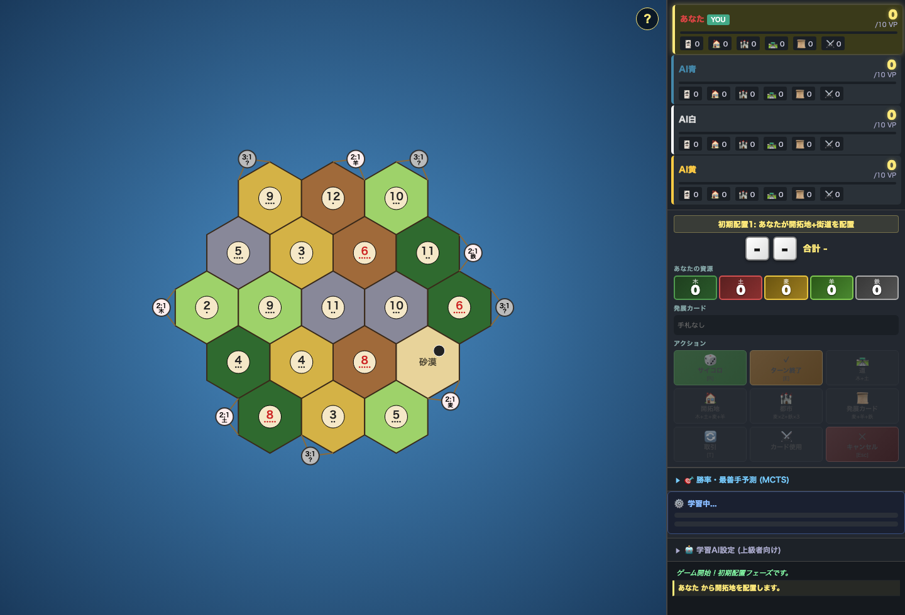

# Catan AI 🏝️🤖

[](https://github.com/8910work-cell/catan-ai/actions)

A from-scratch **value-network + MCTS** agent for *Settlers of Catan*, trained
via headless self-play. Browser-playable, research-informed, and benchmarked
against heuristic baselines with real win-rate numbers.

> **Not affiliated with, endorsed by, or sponsored by CATAN GmbH.** "Catan" /
> "Settlers of Catan" is a trademark of CATAN GmbH. This is an independent,
> non-commercial learning/research project — no official rulebook, art, or
> other copyrighted assets are included in this repository.



## What this is

An AlphaZero-flavored approach to Catan, implemented pragmatically in
JavaScript (browser + Node) with a Python script for foundation-model
initialization:

- **Value network** (`nn.js`, `create_foundation_model.py`) — a small MLP
  (`82 → 256 → 128 → 64 → 1`, sigmoid) trained with TensorFlow.js that scores
  a game state by estimated win probability.
- **MCTS** (`mcts_cpu.js`) — Monte Carlo rollout search using common random
  numbers and progressive narrowing to pick the move with the best estimated
  win rate, for every phase of the game (initial placement, main turn, robber
  placement).
- **Heuristic strong AI** (`strong_ai.js`) — a measurement-driven baseline:
  every heuristic feature is behind a flag and kept only if it measurably
  improved win rate in benchmarks (baseline P0 ≈ 30% with first-player
  advantage; target 35–40%).
- **Self-play training loop** (`auto_train.mjs`, `eval_only.mjs`) — drives the
  browser build headlessly via Playwright to generate games, update weights,
  and re-evaluate.
- **Headless benchmarking** (`node_test.js`, `bench_mcts.js`, `test_mcts.js`)
  — runs `game.js` under Node's `vm` module (no browser) to measure win rate
  and MCTS prediction accuracy at scale, e.g. *MCTS-strongest CPU (P0) vs.
  heuristic AI (P1–3)*.
- **Playable UI** (`index.html`, `style.css`, `ui_enhance.js`) — full board,
  trading, dev cards, and a live "win-probability / best-move" panel backed
  by the same MCTS rollout engine used for training evaluation.

## Why this approach

The design draws on published Catan-AI research rather than starting blind:

- Gendre & Kaneko (2020), *"Playing Catan with Cross-dimensional Neural
  Network"* (arXiv:2008.07079) — an RL agent that outperformed `jsettlers`.
- Szita, Chaslot & Uiterwijk (2010) — MCTS for Catan; pip-count as a key
  signal.
- Driss & Cazenave, *"Deep Catan"* — deep NN + MCTS surpassing MCTS alone.
- Cole Miller, *CatAnalysis* — AlphaZero-style dual-headed NN + MCTS.
- Settlers-RL — feature engineering & PPO self-play.

`nn.js` documents this as a **pragmatic hybrid**: heuristic candidate-move
generation + a learned value network, rather than a pure end-to-end policy
network — chosen for tractable training time on consumer hardware instead of
a datacenter-scale self-play pipeline.

## Repository layout

```
index.html, style.css, ui_enhance.js   # playable board UI
game.js                                # game engine / rules
strong_ai.js                           # measurement-driven heuristic AI
mcts_cpu.js, analysis.js               # MCTS rollout search + win-rate panel
nn.js                                  # TF.js value network (inference + training glue)
create_foundation_model.py             # research-informed weight initialization
auto_train.mjs, eval_only.mjs          # Playwright-driven headless self-play / eval
node_test.js, bench_mcts.js, test_mcts.js  # Node `vm`-based headless benchmarks
catan-vnet.json, catan-vnet.weights*.bin   # saved TF.js model topology + weights
docs/ui.png                            # screenshot
```

## Running it

**Play in the browser** (no build step; TensorFlow.js loads from CDN):

```bash
python3 -m http.server 8000
# open http://localhost:8000/index.html
```

**Headless self-play / benchmarking** (Node + Playwright):

```bash
npm install
node bench_mcts.js 100      # MCTS CPU vs heuristic AI, 100 games
node auto_train.mjs         # drives the browser build to self-play and update weights
```

## Tests

CI (`.github/workflows/ci.yml`) runs both of these on every push — network-free,
no Playwright required:

```bash
node test_mcts.js   # regression suite: MCTS + strong-AI behavior (12 checks)
node node_test.js   # 200-game self-play benchmark; fails CI if any game crashes
```

## Honesty notes

- Baselines and target win rates in `strong_ai.js` are **measured**, not
  assumed — see the file header for the actual P0 win-rate baseline and the
  gating rule (a feature ships only if it moves the measured number).
- This is a personal research/learning project, not a competitive or
  commercial Catan engine. No official CATAN rulebook or artwork is
  distributed here — only original code and screenshots of the custom UI.

## License

Code in this repository is MIT licensed (see `LICENSE`). This license
covers the original code only; it does not grant any rights to the Catan
trademark or game design owned by CATAN GmbH.
